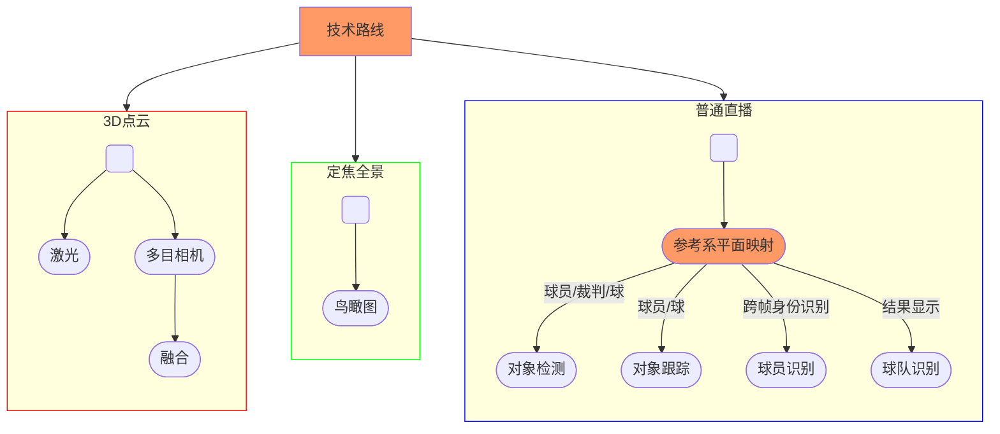

## Framework

## Datasets

- [ISSIA-CNR Soccer dataset][D-1]

[D-1]: https://drive.google.com/file/d/1Pj6syLRShNQWQaunJmAZttUw2jDh8L_f/view?usp=sharing "定焦摄像头固定"

## Papers

- [Deep Learning-Based Football Player Detection in Videos (2022)][P-1]
- [Football Game Video Analysis Method with Deep Learning (2022)][P-2]

[P-1]: https://www.hindawi.com/journals/cin/2022/3540642/
[P-2]: https://www.hindawi.com/journals/cin/2022/3284156/ "主要针对动作识别"

## References

- [FootAndBall: Integrated player and ball detector][R-1]
- [How AI revolutionizes football video analysis for the sub-elite level (2022.8)][R-2]
- [Football Games Analysis from video stream with Machine Learning][R-3]
- [Dive Into Football Analytics With TensorFlow Object Detection API][R-4]

[R-1]: https://github.com/jac99/FootAndBall/tree/master
[R-2]: https://www.track160.com/post/how-ai-revolutionizes-football-video-analysis-for-the-sub-elite-level "简单介绍"
[R-3]: https://towardsdatascience.com/football-games-analysis-from-video-stream-with-machine-learning-745e62b36295
[R-4]: https://neptune.ai/blog/dive-into-football-analytics-with-tensorflow-object-detection-api
