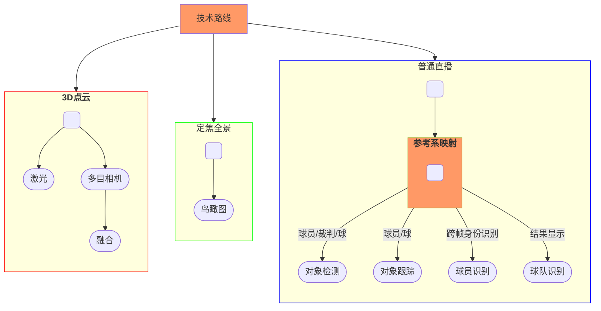

## Framework

## Datasets

- [ISSIA-CNR Soccer dataset][D-1]
- [SoccerNet Dataset][D-2]

[D-2]: https://www.soccer-net.org/data "https://github.com/SoccerNet 卖摄像头设备"
[D-1]: https://drive.google.com/file/d/1Pj6syLRShNQWQaunJmAZttUw2jDh8L_f/view?usp=sharing "定焦摄像头固定"

## Papers

- [Deep Learning-Based Football Player Detection in Videos (2022)][P-1]
- [Football Game Video Analysis Method with Deep Learning (2022)][P-2]
- [Content-Aware Unsupervised Deep Homography Estimation (2020.7)][P-3]
- [Event Detection in Football using Graph Convolutional Networks 2023][P-4]
- [**Sports Camera Calibration via Synthetic Data (2018)**][P-5]
- [**A Robust and Efficient Framework for Sports-Field Registration (2022.10) **][P-6]

[P-6]: https://openaccess.thecvf.com/content/WACV2021/papers/Nie_A_Robust_and_Efficient_Framework_for_Sports-Field_Registration_WACV_2021_paper.pdf
[P-5]: https://arxiv.org/pdf/1810.10658.pdf "https://github.com/lood339/pytorch-two-GAN"
[P-4]: https://arxiv.org/pdf/2301.10052.pdf
[P-1]: https://www.hindawi.com/journals/cin/2022/3540642/
[P-2]: https://www.hindawi.com/journals/cin/2022/3284156/ "主要针对动作识别"
[P-3]: https://arxiv.org/pdf/1909.05983.pdf "https://github.com/JirongZhang/DeepHomography"

## References

- [FootAndBall: Integrated player and ball detector][R-1]
- [How AI revolutionizes football video analysis for the sub-elite level (2022.8)][R-2]
- [Football Games Analysis from video stream with Machine Learning][R-3]
- [Dive Into Football Analytics With TensorFlow Object Detection API][R-4]
- [Homography from football (soccer) field lines][R-5]
- [Sports Field Homography with PyTorch][R-6]
- [Narya API][R-7]
- [Introducing Google Research Football: A Novel Reinforcement Learning Environment 2019.7][R-8]
- [**Football Analysis (Under construction)**][R-9]
- [**How To Obtain The Bird’s Eye View of a Soccer Game Regardless of Camera Angle Changes**][R-10]
- [Enhanced AI models using synthetic data][R-11]
- [Sports Field Registration ][R-12]

[R-12]: https://github.com/ericsujw/KpSFR
[R-11]: https://fluendo.com/en/blog/enhanced-ai-models-using-synthetic-data/
[R-10]: https://medium.com/@amirhossein477/how-to-obtain-the-birds-eye-view-of-a-soccer-game-regardless-of-camera-angle-changes-90d627acd522
[R-1]: https://github.com/jac99/FootAndBall/tree/master
[R-2]: https://www.track160.com/post/how-ai-revolutionizes-football-video-analysis-for-the-sub-elite-level "简单介绍"
[R-3]: https://towardsdatascience.com/football-games-analysis-from-video-stream-with-machine-learning-745e62b36295
[R-4]: https://neptune.ai/blog/dive-into-football-analytics-with-tensorflow-object-detection-api
[R-5]: https://stackoverflow.com/questions/60352448/homography-from-football-soccer-field-lines
[R-6]: https://github.com/darkAlert/sports-field-homography
[R-7]: https://github.com/DonsetPG/narya
[R-8]: https://blog.research.google/2019/06/introducing-google-research-football.html
[R-9]: https://github.com/FootballAnalysis
